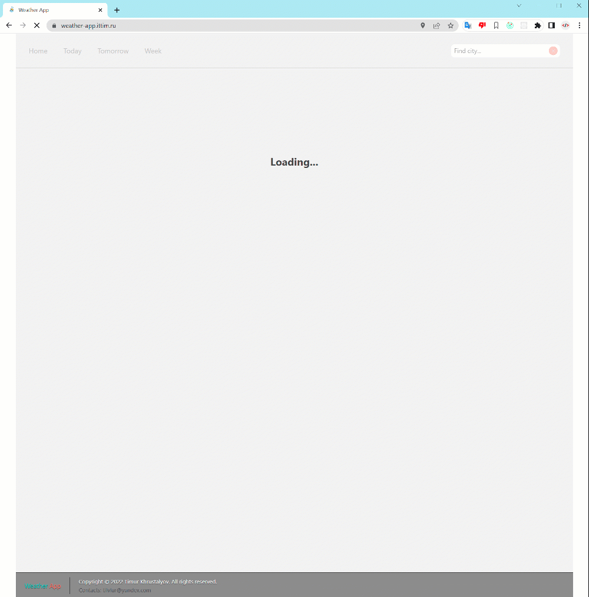
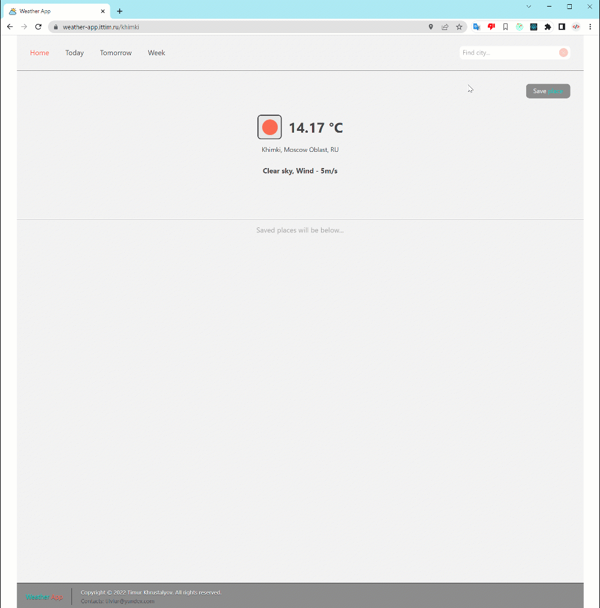
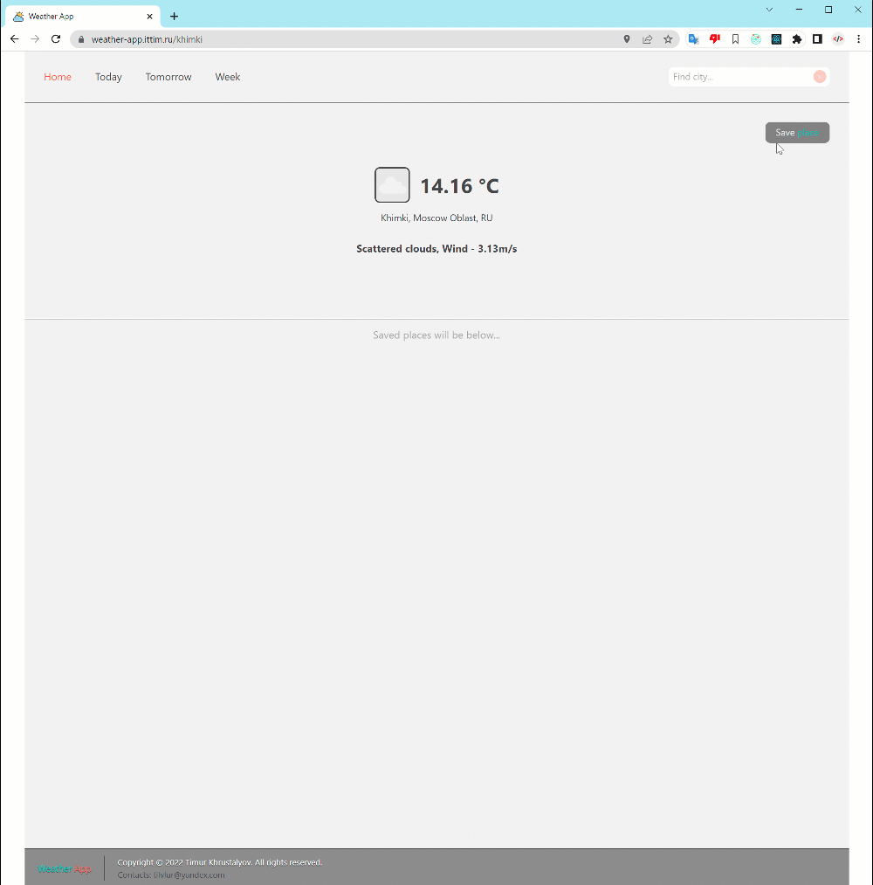
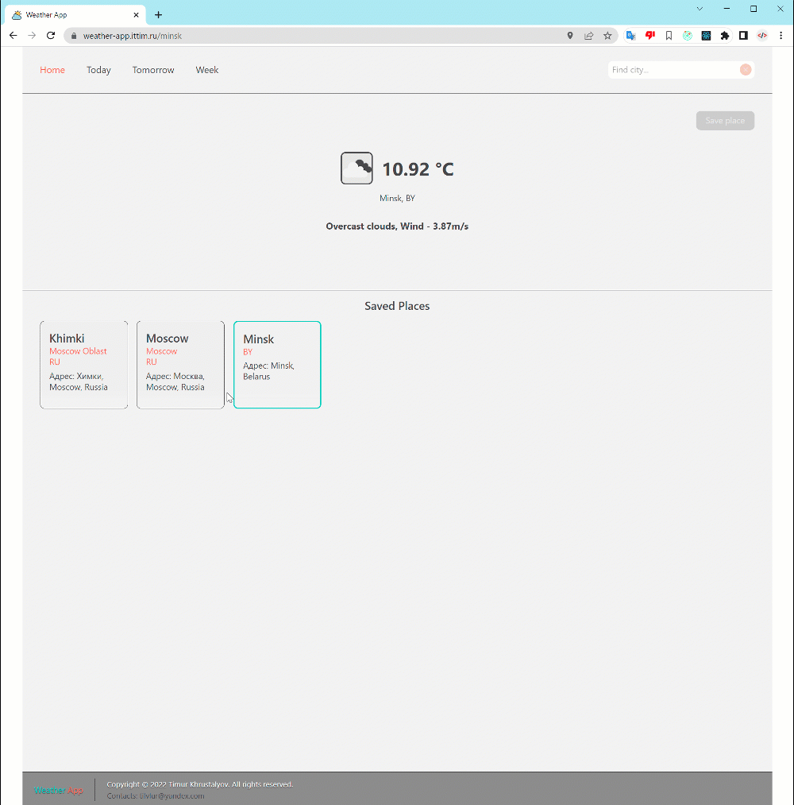
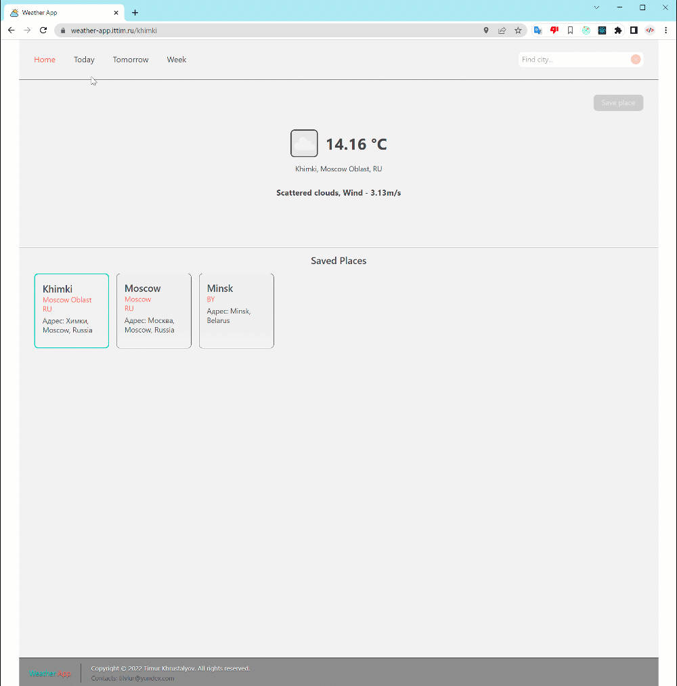
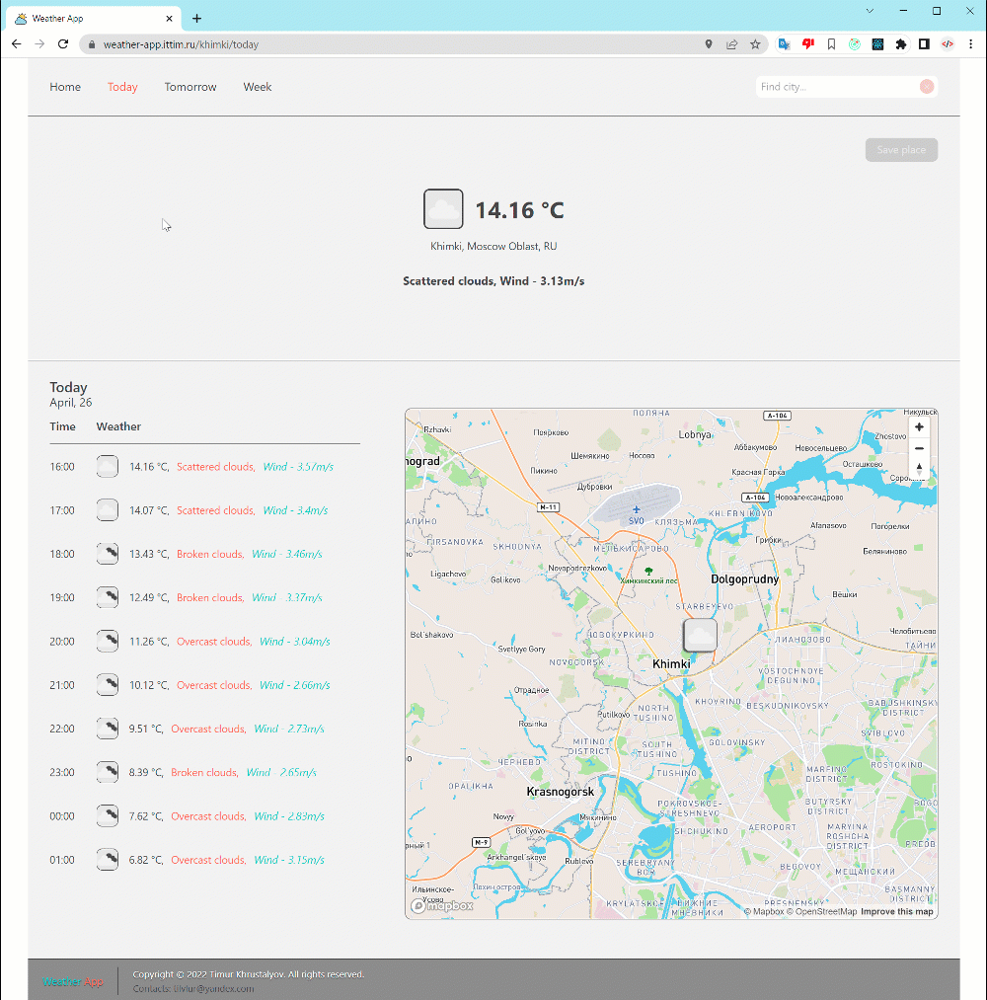

# ⛅️ WEATHER APP


### [🌏](https://weather-app.ittim.ru) [Сайт приложения](https://weather-app.ittim.ru)

## Описание

Веб-приложение прогноза погоды.

1) На главной странице автоматически определяется местоположение пользователя и показывается текущая погода для данного местоположения:



2) Выбор города возможен в текстовом инпуте с автозаполнением:



3) Кнопка "Save place" в правом верхнем углу добавляет город в список сохранённых городов:



4) Клик по блоку сохранённого города открывает новый путь (например: "/moscow"), содержащий подробную информацию о погоде в этом городе:



5) Навигационные ссылки в шапке приложения показывают подробную погоду на сегодня, на завтра или на всю неделю:



6) На страницах "Today" и "Tomorrow" отображается карта с маркером выбранного города. По клику на маркер выводится окошко с информацией о погоде в данный момент.



## Работа с приложением

### 💻 Установка

```
npm i
```

### ⏯ Запуск

```
npm start
```
Приложение будет запущено в режиме разработки.\
Откройте [http://localhost:3000](http://localhost:3000) для просмотра в браузере.\

⚠️ Для работы приложения необходимо создать файл `.env.local` и в данном файле создать переменные с API-токенами. Имена переменных есть в файле `.env-examples️` ⚠️

### 👷 Сборка

```
npm run build
```
Данная команда создаст и сохранит оптимизированную сборку приложения в папке `build`.

### 👨‍⚕️ Проверка кода на ошибки и их исправление

Проверка:

```
npm run lint
```

Исправление:

```
npm run lint:fix
```

## License

Copyright © 2022 Timur Khrustalyov. All rights reserved.\
License: [MIT](LICENSE)
